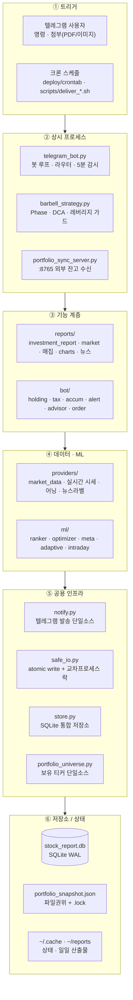
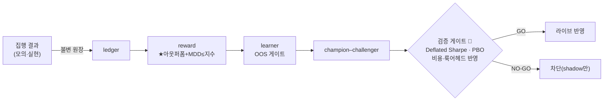

# 📊 Stock Report — Intelligence Barbell

> 감정 없이, 규칙대로. QQQ Phase 기반 개인 투자 자동화 시스템.

미국·한국 주식 포트폴리오를 위한 **안전 우선(safety-first) 개인 투자 자동화 시스템**입니다.
매일 아침 리포트 자동 생성·텔레그램 발송, 시장 국면 변화 즉시 알림, **React/Next.js 기반 프론트엔드**,
그리고 워크포워드 OOS 게이트로 검증하는 적응 학습 기반 모의투자 전략을 포함합니다.

> **TL;DR (EN).** A personal, **safety-first** automation platform for a US/KR equity portfolio:
> daily research reports pushed to Telegram, real-time market-regime alerts, a React/Next.js frontend,
> and paper-trading strategies driven by **walk-forward (OOS) validated** adaptive learning. Core design rule — the system only *advises*; there is **zero real-money auto-execution**
> (enforced by source `grep` tests). ~360 Python modules · 100k+ LOC · 1,500+ tests.

**Stack** · React / Next.js · TypeScript · Python 3.11 · pandas / NumPy · scikit-learn · LightGBM · Optuna · Streamlit · Plotly · Flask · yfinance · SQLite (WAL) · Telegram Bot

<!-- 스크린샷 자리: 퀀트 터미널(대시보드) 캡처/GIF 를 여기에 넣으면 첫인상이 크게 좋아집니다.
     예:  -->

---

## 👀 한눈에

- **안전 우선 설계** — 실계좌 자동매매 경로가 코드에 아예 존재하지 않음(주문 TR/URL 부재를 테스트가 소스 `grep` 으로 강제). 봇은 권고만, 매수는 사용자 수동.
- **6계층 단방향 아키텍처** — 트리거 → 상시 프로세스 → 기능 → 데이터·ML → 공용 인프라 → 저장소.
- **적응 학습 + OOS 게이트** — 집행 결과를 불변 원장에 기록 → ★목적함수(아웃퍼폼 + MDD ≤ 지수)로 채점 → **백테스트 워크포워드 게이트 통과분만** 라이브 반영, 미입증은 shadow(기본 OFF).
- **정직한 결론** — 6-Tier 퀀트 프로그램 중 **구조적 레버리지 1개만 GO**, 나머지(팩터·인컴·집중)는 엣지 부재로 NO-GO 명시.
- **실시간 데이터 + 퀀트 터미널** — KIS 실시간 시세(read-only) 오버레이 + Streamlit 8페이지(Plotly 캔들·드로잉 도구·백테스트·모의투자 원장).
- **운영 신뢰성** — 프로세스 워치독(생존 + 코드 신선도 감시)·30분 헬스체크·단일 진실원 크론.

| 규모 | 값 |
|------|-----|
| Python 모듈 | ~360개 (`ml` 49 · `crons` 39 · `providers` 25 · `dashboard` 20 · `bot` 13 · `reports` 11 · `lib` 17 …) |
| 코드 규모 | 100,000+ LOC (Python) |
| 테스트 | 1,500+ 테스트 함수 · 137개 파일 (무네트워크 합성 데이터 위주) |
| 자동화 크론 | 50+ 스케줄 (`deploy/crontab.stock-report` 단일 진실원) |
| 대시보드 | Streamlit 8페이지 |

---

## 🧩 왜 만들었나 (문제 정의)

개인 투자에서 반복되는 실패는 **감정적 매매**와 **일관성 없는 규칙 적용**입니다. 이 시스템은
QQQ 고점 대비 낙폭을 기준으로 한 규칙 기반 **Phase 전술배분**을 자동화하되, 다음 두 원칙을 지킵니다.

1. **자동집행은 하지 않는다** — 잘못된 자동매매의 파국적 위험을 원천 차단. 시스템은 계측·권고·기록만 하고, 실제 주문은 사람이 누른다.
2. **검증되지 않은 엣지는 라이브에 넣지 않는다** — 모든 전략 조정은 룩어헤드·비용을 반영한 워크포워드 백테스트 게이트(Deflated Sharpe·PBO)를 통과해야 반영되고, 미검증은 shadow 로만 계측한다.

---

## 🏗 아키텍처

위(트리거) → 아래(저장소) **단방향 데이터 흐름**의 6계층 구조입니다.

**두 가지 핵심 런타임 흐름**

- **일일 리포트 (크론 23:00 UTC = KST 08:00)** — `scripts/deliver_investment_report.sh` → `reports/investment_report` 가 `providers/market_data`(가격) · `reports/*`(펀더멘털·신호·매집·차트) · `ml/*`(랭킹)을 호출 → `~/reports/` 에 `.md/.json/.txt/.png` 산출 → `notify` 로 문서·이미지 발송.
- **전략 판정 (봇 5분 주기 + 크론)** — `barbell_strategy.run()` → `market_data.fetch_qqq_data()`(**stale 서킷브레이커**) → `classify_market()`(히스테리시스 + 낙폭 앵커) → `calculate_dca()`(+ **leverage_dca_guard**: 변동성 캡·낙폭 정지) → `build_report()` → `notify`.

---

## 🔧 엔지니어링 하이라이트

포트폴리오 관점에서 이 프로젝트가 보여주는 것:

### 1. 안전 우선 설계 (자동매매 0 · 하드블록)
- 실계좌 주문 URL/TR/함수가 **코드에 존재하지 않으며**, 이를 테스트가 소스 `grep` 으로 강제한다. 실시간 시세·브로커 API 는 전부 **read-only**(도메인 하드락).
- 모의투자만 자동 집행(`*_MOCK_ENABLED` opt-in), 실계좌는 항상 사람이 수동.
- 게스트 RBAC — "서술 OK, 지시 금지"(처방형 명령 전면 차단), 로그 토큰 마스킹, LLM 프롬프트 인젝션 가드.

### 2. 동시성 · 데이터 정합성
- 봇(상시) + 다수 크론이 같은 파일을 동시에 쓰므로 `safe_io` 가 **atomic write(temp→rename)** + **교차 프로세스 파일 락**으로 torn read·lost update 를 차단.
- `portfolio_snapshot.json` = 파일 권위 + `store`(SQLite WAL) 그림자의 **이중 권위** 모델. 봇은 `fcntl` 단일 인스턴스 락.
- 해외 잔고 이중 writer 는 `OVERSEAS_SYNC_SOURCE` 단일 소스 게이트로 구조적 차단.

### 3. 적응 학습 + 백테스트 OOS 게이트
집행 결과가 학습 엔진으로 피드백되어 **★목적함수(아웃퍼폼 + MDD ≤ 지수)** 로 채점·재튜닝되되, 조정 제안은 워크포워드 OOS 게이트를 통과해야만 라이브 반영됩니다(미입증은 shadow, 기본 OFF).

