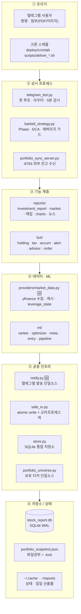

# 📊 Stock Report — Intelligence Barbell v2.9

> 감정 없이, 규칙대로. QQQ Phase 기반 자동화 투자 시스템.

미국 주식 포트폴리오의 **매일 아침 리포트 자동 생성 + 텔레그램 발송**,  
시장 국면 변화 시 **즉시 알림**, 키움증권 국내주식 잔고 **자동 동기화**까지 포함한 개인 투자 자동화 시스템입니다.

---

## 🏗 아키텍처 구조

위(트리거) → 아래(저장소) **단방향 데이터 흐름**의 6계층 구조입니다. 🆕 = 최근 아키텍처 리팩토링으로 신설·분리된 모듈.



### 두 가지 핵심 런타임 흐름

**① 일일 리포트 (크론 23:00 UTC = KST 08:00)**
`scripts/deliver_investment_report.sh` → `reports/investment_report.generate_report()` 가 `providers/market_data`(가격) · `reports/*`(펀더멘털·신호·매집·차트) · `ml/*`(랭킹)을 호출 → `~/reports/` 에 `.md/.json/.txt/.png` 산출 → `notify` 로 `sendDocument` + `sendPhoto` 발송.

**② 전략 판정 (봇 5분 주기 + 크론)**
`barbell_strategy.run()` → `market_data.fetch_qqq_data()` (**stale 서킷브레이커**) → `classify_market()` (히스테리시스 + 낙폭 앵커) → `calculate_dca()` (+ **leverage_dca_guard**: 변동성 캡·낙폭 정지) → `build_report()` → `notify`.

### 상태 관리 · 동시성
- **이중 권위**: `portfolio_snapshot.json` = 파일 권위 + `store`(SQLite) 그림자. 그 외 상태(barbell_state·anchor·leverage_state·가중치)는 **store 권위 + 파일 미러**.
- **동시성**: 봇(상시) + 다수 크론이 같은 파일을 쓰므로 `safe_io.file_write_lock`(교차 프로세스 락) + `atomic_write_json`(temp→rename, torn read 차단). 봇은 `fcntl` 단일 인스턴스 락, store 는 SQLite WAL.

### 안전 경계
- **매매 미실행**(하드블록) — 봇은 *권고만*, 매수는 사용자 수동.
- 레버리지 가드(변동성캡·절대상한·낙폭정지) · stale 데이터 시 Phase 에스컬레이션 보류 · 게스트 RBAC(서술 OK·지시 금지) · 로그 토큰 마스킹.

---

## ⚙️ 스크립트 목록

| 파일 | 역할 |
|------|------|
| `barbell_strategy.py` | Intelligence Barbell v2.1 — Phase 분류, SGOV/DCA/레버리지 계산, 시각화 리포트 |
| `telegram_bot.py` | 양방향 텔레그램 봇 — 명령어 라우터, fcntl 단일 인스턴스 잠금, Phase 감시 |
| `holding_commands.py` | /holding 서브커맨드 핸들러 (buy·sell·target·dca·dividend·apply 등) |
| `tax_commands.py` | /tax 서브커맨드 핸들러 (sim·sell·history·delete·import) |
| `investment_report.py` | 포트폴리오 수익률 + 펀더멘털 분석 Markdown 리포트 |
| `holding_manager.py` | 보유 종목 CRUD + DCA/목표비중 파일 관리 (atomic write) |
| `attachment_parser.py` | PDF·이미지 OCR 파싱 → 포트폴리오·매도내역 자동 감지 |
| `order_generator.py` | Phase 기반 소수점 매수 주문서 생성 |
| `portfolio_tracker.py` | 일일 히스토리 기록 + 배당 기록 |
| `tax_tracker.py` | 실현손익 기록 + 양도소득세 추산 |
| `price_alerts.py` | 가격 알림 등록·체크 |
| `source_collector.py` | 뉴스 JSONL 캐시 수집·다이제스트 |
| `stock_advisor.py` | AI 포트폴리오 상담 (/ask) |
| `kiwoom_sync_rest.py` | 키움 REST API → 국내주식 잔고 자동 동기화 (크론 08:35) |
| `portfolio_sync_server.py` | 외부 → portfolio_snapshot.json 수신 서버 (port 8765) |
| `bot_healthcheck.py` | 봇·서버 상태 30분 자동 점검 — 중복 인스턴스·409 Conflict·PID 불일치·파일 신선도 |
| `bot_smoke_test.py` | 봇 기능 연기 테스트 — 25개 항목 실데이터 검증, 실패 시만 알림 |
| `fundamental_score.py` | 종목별 100점 펀더멘털 스코어링 |
| `daily_signals.py` | 가격/거래량 기반 일일 신호 감지 |
| `market_report.py` | 시장 뉴스 리포트 (SaveTicker API + Arca Live) |
| `backtest.py` | 단일 기간 바벨 전략 백테스트 |
| `backtest_multi.py` | 5/10/20년 및 사용자 지정 시작일 멀티 백테스트 |
| `save_csv.py` | JSON 요약 → CSV 내보내기 |
| `deliver_investment_report.sh` | 전체 파이프라인 실행 + 텔레그램 발송 |

---

## 🆕 최근 업그레이드

### v2.9 — 기관 매집·시각화·안전장치·아키텍처 리팩토링 (2026-06)

- **기관 매집 추적** (`reports/institutional_flow.py`) — 거래량 방향성(OBV·CMF·A/D) 매집 강도 + 美 13F 교차검증, 일일 리포트 섹션 + `/accum` + 주간 스냅샷.
- **시각화 대시보드** (`reports/report_charts.py`) — 등락률·벤치마크·RSI·매집강도 4분할 PNG 를 텔레그램 `sendPhoto`.
- **안전장치** — 레버리지/DCA 가드(변동성 캡·절대 상한·낙폭 정지) + 가격 stale 서킷브레이커 + portfolio_snapshot 교차프로세스 락(`safe_io`) + yfinance 재시도.
- **보안 하드닝** — Bearer timing-safe 비교·HTTP500 정보노출 차단·pickle `safe_unpickle`·LLM 프롬프트 인젝션 가드·토큰 마스킹.
- **아키텍처 리팩토링** — 텔레그램 발송 14곳 → `notify.py` 단일 진실원, barbell 데이터층 → `providers/market_data.py` 분리(god-module 2272→1773줄), `generate_report`·`build_report` 거대 함수 분해, `PORTFOLIO_PATH` 단일 소스. (전체 450+ 테스트 통과)

### v2.8 — ML Pipeline Smoke Test / p12 (2026-06-06)

- **`ml_smoke_test.py` 신규** — p3~p11 전체 ML 파이프라인 end-to-end 연기 테스트 (46 checks, 0.7초)
  - 네트워크 없이 합성 데이터만 사용, 실패 시 텔레그램 알림
  - 크론 등록 권장: `0 0 * * 1-5 uv run python ml_smoke_test.py`

### v2.7 — ML Sweet Spot Optimizer (2026-06-06)

- **`ml/sweet_spot.py` 신규** — AR(1) 은닉 신호 기반 합성 시장 데이터 생성기 (`generate_synthetic_market_data`)
  - DGP는 causal (t일 수익률 = t-1 신호 기반) → lookahead 없음
  - 임계값 전략 평가기 (`evaluate_threshold_strategy`) — `shift(1)` 포지션 지연 적용
  - 그리드서치 옵티마이저 (`optimize_sweet_spot`) — threshold / max_weight / safe_weight 탐색
  - Composite score: CAGR + MDD 패널티 + 회전율 패널티 + QQQ 초과수익
  - 2-fold walk-forward 요약 + equity curve / trial scatter 선택적 matplotlib 출력
- **`/mlreport` 샘플 교체** — `build_sample_ml_strategy_report()`가 고정 양수 경로 대신 옵티마이저 실제 결과 출력
  - 음수 수익률 숨기지 않음 (synthetic seed=42 기준 SPY -48%, ML +9.6%)
- **테스트 27개 추가** — `tests/test_ml_sweet_spot.py`
  - 합성 데이터 형태·결정성, shift(1) no-lookahead 검증, 옵티마이저 일관성 검증

### v2.6 — 봇 안정성 강화 & UX 개선 (2026-06-05)

- **단일 인스턴스 잠금** — `fcntl.flock`으로 중복 봇 프로세스 원천 차단  
  PID 파일 위치: `~/.local/state/stock-report/barbell_bot.pid`
- **커맨드 모듈 분리** — `holding_commands.py` · `tax_commands.py`로 분리해 유지보수성 향상
- **QQQ 데이터 가드** — `fetch_qqq_data()` None 반환 시 봇 crash 방지
- **헬스체크 강화** — 중복 인스턴스 감지, PID 불일치 감지, 409 Conflict 로그 감지, `uv: not found` 크론 오류 감지
- **봇 smoke test** — `bot_smoke_test.py` 25개 항목 실데이터 검증 크론 (매일 09:00 KST)
- **UX 개선**
  - `/portfolio` 개별 종목 P&L 표 추가 (평가금액·수익률 내림차순)
  - `/status` QQQ 1M 모멘텀 + 포트폴리오 수익률 추가
  - `/summary` 신규 — 한 줄 빠른 현황 (`Phase · QQQ · 총액 · F&G`)
- **코드 품질** — `_cache` Lock, `send()` 줄바꿈 분할, atomic file write, silent except → logging

### v2.5 — 외부 데이터 연동 (2026-06-04)

- **CNN Fear & Greed Index 통합** — QQQ 레이더 섹션에 F&G 점수·막대·1주 트렌드 표시  
  (`/status`, `/report`, `/phase` 모두 반영)
- **키움 REST API 국내주식 잔고 동기화** — `kiwoom_sync_rest.py` 매일 08:35 KST 자동 실행  
  계좌평가잔고(kt00018) → `portfolio_snapshot.json` domestic 섹션 업데이트
- **명령어 통합** — `/dividend` → `/holding dividend`, `/apply_snapshot` → `/holding apply`  
  (기존 명령어는 하위 호환 유지)
- **portfolio_sync_server.py** — 외부 잔고 데이터 수신용 Flask 서버 (port 8765)

### v2.4 — 버그 수정 & 코드 품질 (2026-06-04)

- **Phase 5 중복 알림 차단** — 크론·봇이 `~/.cache/barbell_state.json` 단일 파일 공유  
  Phase 5 에스컬레이션이 최대 6회 발송되던 문제 해결
- **`calculate_safety_margin` NameError 수정** — `try` 블록 변수 스코프 버그 제거
- **파일 핸들 누수 수정** — 전체 `json.load(open(...))` 패턴을 `with` 블록으로 교체
- **`attachment_parser` 날짜 필터링** — 날짜 구성 숫자가 주수·단가로 오파싱되는 오류 차단
- **Dead code 제거** — `STOCK_TARGET_WEIGHTS`, `REBAL_DCA_WEIGHTS`, 중복 import 제거
- **동적 P&L 경고** — `build_report()` 하드코딩 손익 → 실시간 `holdings_detail` 계산
- **DCA 막대 스케일** — `show_dca_weights()` 기준값 0.25 고정 → `max(weights)` 동적 계산

### v2.3 — 세금 추산 + 첨부파일 파싱 + 배당 예상

- `/tax sim TICKER` — 매도 전 세금 영향 시뮬레이션
- `/tax import apply` — PDF·스크린샷에서 파싱된 매도내역 세금 기록 일괄 반영
- `attachment_parser.py` — PDF(pypdf) + 이미지(tesseract OCR) 자동 파싱
- `/holding apply` — 파싱된 포트폴리오 스냅샷 반영 (자동 백업 포함)
- `/holding dividend` — QQQI 배당 수령 기록 + 다음 배당 예상일 자동 추산

### v2.2 — 포트폴리오 CRUD + Phase 에스컬레이션

- `/holding buy/sell/target/dca/refresh` — 보유 종목 직접 관리
- `/order` — 현재 Phase 기반 소수점 매수 주문서 즉시 생성
- Phase 5 크래시 진입 시 긴급 알림 3회 연속 발송

---

## 🏋️ Intelligence Barbell v2.1

### Phase 테이블

| Phase | 조건 | DCA | SGOV | 레버리지 |
|-------|------|-----|------|---------|
| 🫧 Bull-2 | RSI>75 + 1M>8% + VIX<15 | 0.5× | 20% 비축 | — |
| 🐂 Bull-1 | RSI>70 또는 1M>5% | 0.8× | 12% 비축 | — |
| 🟢 Phase 0 | 고점 -5% 이내 | 1.0× | 8% 유지 | — |
| 🟡 Phase 1 | -5% ~ -10% | 1.5× | 유지 | — |
| 🟠 Phase 2 | -10% ~ -15% | 2.0× | 30% → QLD | QLD |
| 🔴 Phase 3 | -15% ~ -20% | 2.5× | +35% → QLD | QLD |
| 🚨 Phase 4 | -20% ~ -30% | 3.0× | 전량 전환 | QLD 70 + TQQQ 30 |
| 💥 Phase 5 | -30%+ | 5.0× | QQQI 20~30% | TQQQ 전면 |

### 리포트 샘플

```
🏋️ Intelligence Barbell v2.1
📅 2026-06-04 08:00 KST

📍 Phase  🟢 Phase 0 — 정상 모드
 B2    B1   [N0]   P1    P2    P3    P4    P5
 🫧    🐂   ◉🟢    🟡    🟠    🔴    🚨    💥
  QQQ 고점 대비  -1.00%   정상 DCA 유지.

━━━ 📈 QQQ 레이더 ━━━
  현재가  $  515.20   52주高 $527.50  低 $395.20
  낙폭      -2.33%   52주위치 ████████████ 96%
  RSI   58.0  ███████░░░░░  중립 ✅
  VIX   17.5  ████░░░░░░░░  정상 ✅
  F&G  53.5  ██████░░░░░░  😐 중립 (1W:▼-7)   ← CNN Fear & Greed
  200MA     +12.3%  ✅
```

---

## 🚀 설치 및 설정

### 요구사항

```
python3 (3.10+)
uv  (패키지 관리)
tesseract-ocr (선택, 이미지 OCR)
```

```bash
uv pip install yfinance numpy pandas requests beautifulsoup4 python-dotenv pypdf flask kiwoom-rest-api
```

### 환경변수 설정

```bash
cp .env.example .env
```

| 변수 | 필수 | 설명 |
|------|------|------|
| `STOCK_BOT_TOKEN` | ✅ | 텔레그램 봇 토큰 |
| `STOCK_BOT_CHAT_ID` | — | 수신 chat_id (기본: 5771238245) |
| `KIWOOM_API_KEY` | — | 키움 REST API 앱 키 (openapi.kiwoom.com) |
| `KIWOOM_API_SECRET` | — | 키움 REST API 앱 시크릿 |
| `SYNC_TOKEN` | — | portfolio_sync_server 인증 토큰 |
| `SYNC_PORT` | — | 동기화 서버 포트 (기본: 8765) |

---

## 🤖 텔레그램 봇 명령어

```
── 시장 현황 ─────────────────────────────────────────────────────
/status              Phase + 핵심 수치 + 1M모멘텀 + 수익률 (5분 캐시)
/summary             한 줄 빠른 현황 — Phase·QQQ·총액·F&G
/phase               Phase 미터 + 행동 지침
/report              전체 바벨 리포트 (항상 실시간)
/sim [bull2|0~5]     시장 상태 시뮬레이션

── 포트폴리오 ────────────────────────────────────────────────────
/portfolio           보유현황 + 총액
/rebalance           안전마진 + 종목 비중 진단 + DCA 조정
/history [1d|7d|30d|90d]  성과 히스토리
/sgov                SGOV 실탄 현재/목표 비교

── DCA & 주문 ────────────────────────────────────────────────────
/dca                 오늘 DCA 배분 금액
/order               소수점 매수 주문서 (키움 즉시 입력)

── 종목 관리 ─────────────────────────────────────────────────────
/holding                             보유 종목 목록
/holding buy TICKER 주수 단가 [frac] 매수 기록 + 가격 갱신
/holding sell TICKER [주수]          매도 기록
/holding target [TICKER 비중% ...]   목표 비중 조회/설정
/holding dca [TICKER 비중% ...]      DCA 비중 조회/변경
/holding refresh                     전 종목 현재가 갱신
/holding dividend [금액 TICKER]      QQQI 배당 조회/기록
/holding apply                       파싱된 스냅샷 반영

── 세금 ──────────────────────────────────────────────────────────
/tax                                 올해 실현손익 + 양도세 추산
/tax sim TICKER [수량] [단가]         매도 전 세금 시뮬레이션
/tax sell TICKER 수량 매수단가 매도단가  매도 기록
/tax history                         전체 매도 기록
/tax delete N                        N번 기록 삭제
/tax import apply                    파싱된 매도내역 일괄 반영

── AI 상담 & 알림 ────────────────────────────────────────────────
/ask 질문                            AI 포트폴리오 상담
/alert add TICKER 가격 buy|sell [메모]  가격 알림 등록
/alert list                          알림 목록
/alert remove ID                     알림 삭제

📎 PDF·이미지 전송 → 자동 파싱 → /holding apply 또는 /tax import apply
```

> `/dividend` → `/holding dividend` 통합, `/apply_snapshot` → `/holding apply` 통합  
> 기존 명령어는 하위 호환으로 유지

---

## 🏦 키움 REST API 연동

국내주식 잔고를 매일 자동으로 `portfolio_snapshot.json`에 동기화합니다.

### 설정

1. [openapi.kiwoom.com](https://openapi.kiwoom.com) → 앱 등록 → API Key/Secret 발급
2. 서버 IP를 IP 등록 목록에 추가
3. `.env`에 추가:
   ```
   KIWOOM_API_KEY=발급받은_키
   KIWOOM_API_SECRET=발급받은_시크릿
   ```

### 크론 등록 (이미 설정됨)

```cron
# 매일 KST 08:35 (UTC 23:35) 월~금 자동 실행
35 23 * * 1-5 cd /path/to/stock-report && uv run python kiwoom_sync_rest.py >> /tmp/kiwoom_sync.log 2>&1
```

---

## ⏰ 크론 설정 전체

```cron
# 일일 투자 리포트 (KST 08:00)
0 23 * * 1-5 /path/to/deliver_investment_report.sh >> /tmp/stock_cron.log 2>&1

# 키움 국내주식 잔고 동기화 (KST 08:35)
35 23 * * 1-5 cd /path/to/stock-report && uv run python kiwoom_sync_rest.py >> /tmp/kiwoom_sync.log 2>&1

# 봇 기능 연기 테스트 (KST 09:00, 실패 시만 알림)
0 0 * * 1-5 cd /path/to/stock-report && uv run python bot_smoke_test.py >> /tmp/smoke_test.log 2>&1

# 봇·서버 헬스체크 (30분마다, 문제 시만 알림)
*/30 * * * * cd /path/to/stock-report && uv run python bot_healthcheck.py >> /tmp/healthcheck.log 2>&1

# 봇 watchdog (1분마다)
* * * * * /path/to/stock-report/bot_watchdog.sh

# 서버 재부팅 시 봇 자동 시작
@reboot /path/to/stock-report/bot_watchdog.sh
```

---

## 📁 파일 구조

> 루트의 흩어져 있던 파일들은 `bot/` · `reports/` · `ml/` · `crons/` · `providers/` 폴더로 분류 정리되었습니다.

```
stock-report/
├── (루트) 상시 프로세스 + 공용 인프라
│   ├── telegram_bot.py            # 양방향 봇 — 라우터·5분 감시·fcntl 단일 인스턴스
│   ├── barbell_strategy.py        # Intelligence Barbell 전략 — Phase·DCA·레버리지 가드
│   ├── portfolio_sync_server.py   # 외부 잔고 수신 Flask 서버 (:8765)
│   ├── holding_manager.py         # 보유 종목 CRUD (atomic write)
│   ├── portfolio_tracker.py       # 일일 히스토리·배당 기록
│   ├── tax_tracker.py             # 실현손익·양도세
│   ├── portfolio_universe.py      # 보유 티커 단일 소스 + 은퇴 티커
│   ├── store.py        🆕 인프라  # SQLite 통합 저장소 (WAL, user_id 스코프)
│   ├── safe_io.py      🆕 인프라  # atomic write + 교차 프로세스 쓰기 락
│   └── notify.py       🆕 인프라  # 텔레그램 발송 단일 진실원
├── providers/          🆕 데이터 수집층
│   └── market_data.py             # yfinance 수집·캐시·앵커·leverage_state
├── bot/                # 텔레그램 서브커맨드
│   ├── holding_commands.py · tax_commands.py · accum_commands.py · entry_commands.py
│   ├── price_alerts.py · attachment_parser.py · stock_advisor.py · order_generator.py
│   └── guest_report.py · guest_portfolio.py     # 읽기전용 게스트
├── reports/            # 리포트·데이터 생성
│   ├── investment_report.py · market_report.py · source_collector.py
│   ├── fundamental_score.py · daily_signals.py · institutional_flow.py
│   └── report_charts.py · save_csv.py
├── ml/                 # ML 모델·파이프라인
│   ├── ranker.py · leverage_optimizer.py · leverage_signal.py · meta_allocator.py
│   ├── entry_analyzer.py · data_pipeline.py · features.py · sweet_spot.py
│   └── _safe_cache.py(안전 역직렬화) · intraday_signal.py · ...
├── crons/              # 크론 진입점
│   ├── daily_ranking.py · daily_leverage_retrain.py · kiwoom_sync_rest.py
│   ├── news_spike_detector.py · notion_sync.py · paper_track.py
│   └── *_snapshot.py(fundamental·options·institutional) · reminder·weekly_retrain
├── tests/              # 스모크·헬스체크·단위 테스트 (450+)
├── backtest/           # 백테스트 분석 (개발용)
├── scripts/            # deliver_investment_report.sh · watchdog 등
├── deploy/crontab.stock-report    # 크론 스케줄 단일 진실원
├── CLAUDE.md                      # 프로젝트 컨텍스트 (Claude Code용)
└── 🔒 .env · portfolio_snapshot.json · leverage_state.json · price_alerts.json  (커밋 금지)

# 런타임 상태/데이터 (레포 밖)
~/.local/share/stock-report/stock_report.db   # SQLite 통합 저장소 (store)
~/.local/state/stock-report/barbell_bot.pid   # 봇 PID (단일 인스턴스 잠금)
~/.cache/barbell_state·anchor·last_prices.json # Phase·낙폭앵커·직전가 (+ .lock)
~/reports/                                     # 일일 산출물(md/json/txt/png) + ml-cache
```

---

## 📦 의존성

```bash
uv pip install yfinance pandas numpy requests beautifulsoup4 python-dotenv pypdf flask kiwoom-rest-api
# 이미지 OCR (선택)
sudo apt install tesseract-ocr tesseract-ocr-kor
```

---

## ⚠️ 주의사항

- 개인 투자 자동화 도구입니다. 투자 결과에 대한 책임은 본인에게 있습니다.
- yfinance 무료 API 기반으로 **전일 종가** 기준 데이터를 사용합니다.
- Phase 알림은 **변화가 있을 때만** 발송됩니다 (중복 방지).
- `.env`, `portfolio_snapshot.json` 등 민감 파일은 절대 커밋하지 마세요.
