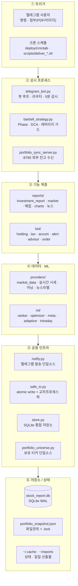
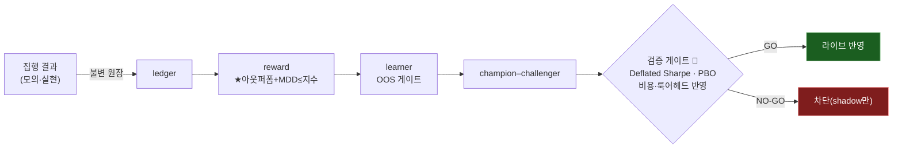

# 📊 Stock Report — Intelligence Barbell

> 감정 없이, 규칙대로. QQQ Phase 기반 개인 투자 자동화 시스템.

미국·한국 주식 포트폴리오를 위한 **안전 우선(safety-first) 개인 투자 자동화 시스템**입니다.
매일 아침 리포트 자동 생성·텔레그램 발송, 시장 국면 변화 즉시 알림, **Streamlit 퀀트 터미널**,
그리고 워크포워드 OOS 게이트로 검증하는 적응 학습 기반 모의투자 전략을 포함합니다.

> **TL;DR (EN).** A personal, **safety-first** automation platform for a US/KR equity portfolio:
> daily research reports pushed to Telegram, real-time market-regime alerts, an 8-page **Streamlit
> quant terminal**, and paper-trading strategies driven by **walk-forward (OOS) validated** adaptive
> learning. Core design rule — the system only *advises*; there is **zero real-money auto-execution**
> (enforced by source `grep` tests). ~360 Python modules · 100k+ LOC · 1,500+ tests.

**Stack** · Python 3.11 · pandas / NumPy · scikit-learn · LightGBM · Optuna · Streamlit · Plotly · Flask · yfinance · SQLite (WAL) · Telegram Bot

<!-- 스크린샷 자리: 퀀트 터미널(대시보드) 캡처/GIF 를 여기에 넣으면 첫인상이 크게 좋아집니다.
     예:  -->

---

## 👀 한눈에

- **안전 우선 설계** — 실계좌 자동매매 경로가 코드에 아예 존재하지 않음(주문 TR/URL 부재를 테스트가 소스 `grep` 으로 강제). 봇은 권고만, 매수는 사용자 수동.
- **6계층 단방향 아키텍처** — 트리거 → 상시 프로세스 → 기능 → 데이터·ML → 공용 인프라 → 저장소.
- **적응 학습 + OOS 게이트** — 집행 결과를 불변 원장에 기록 → ★목적함수(아웃퍼폼 + MDD ≤ 지수)로 채점 → **백테스트 워크포워드 게이트 통과분만** 라이브 반영, 미입증은 shadow(기본 OFF).
- **정직한 결론** — 6-Tier 퀀트 프로그램 중 **구조적 레버리지 1개만 GO**, 나머지(팩터·인컴·집중)는 엣지 부재로 NO-GO 명시.
- **실시간 데이터 + 퀀트 터미널** — KIS 실시간 시세(read-only) 오버레이 + Streamlit 8페이지(Plotly 캔들·드로잉 도구·백테스트·모의투자 원장).
- **운영 신뢰성** — 프로세스 워치독(생존 + 코드 신선도 감시)·30분 헬스체크·단일 진실원 크론.

| 규모 | 값 |
|------|-----|
| Python 모듈 | ~360개 (`ml` 49 · `crons` 39 · `providers` 25 · `dashboard` 20 · `bot` 13 · `reports` 11 · `lib` 17 …) |
| 코드 규모 | 100,000+ LOC (Python) |
| 테스트 | 1,500+ 테스트 함수 · 137개 파일 (무네트워크 합성 데이터 위주) |
| 자동화 크론 | 50+ 스케줄 (`deploy/crontab.stock-report` 단일 진실원) |
| 대시보드 | Streamlit 8페이지 |

---

## 🧩 왜 만들었나 (문제 정의)

개인 투자에서 반복되는 실패는 **감정적 매매**와 **일관성 없는 규칙 적용**입니다. 이 시스템은
QQQ 고점 대비 낙폭을 기준으로 한 규칙 기반 **Phase 전술배분**을 자동화하되, 다음 두 원칙을 지킵니다.

1. **자동집행은 하지 않는다** — 잘못된 자동매매의 파국적 위험을 원천 차단. 시스템은 계측·권고·기록만 하고, 실제 주문은 사람이 누른다.
2. **검증되지 않은 엣지는 라이브에 넣지 않는다** — 모든 전략 조정은 룩어헤드·비용을 반영한 워크포워드 백테스트 게이트(Deflated Sharpe·PBO)를 통과해야 반영되고, 미검증은 shadow 로만 계측한다.

---

## 🏗 아키텍처

위(트리거) → 아래(저장소) **단방향 데이터 흐름**의 6계층 구조입니다.



**두 가지 핵심 런타임 흐름**

- **일일 리포트 (크론 23:00 UTC = KST 08:00)** — `scripts/deliver_investment_report.sh` → `reports/investment_report` 가 `providers/market_data`(가격) · `reports/*`(펀더멘털·신호·매집·차트) · `ml/*`(랭킹)을 호출 → `~/reports/` 에 `.md/.json/.txt/.png` 산출 → `notify` 로 문서·이미지 발송.
- **전략 판정 (봇 5분 주기 + 크론)** — `barbell_strategy.run()` → `market_data.fetch_qqq_data()`(**stale 서킷브레이커**) → `classify_market()`(히스테리시스 + 낙폭 앵커) → `calculate_dca()`(+ **leverage_dca_guard**: 변동성 캡·낙폭 정지) → `build_report()` → `notify`.

---

## 🔧 엔지니어링 하이라이트

포트폴리오 관점에서 이 프로젝트가 보여주는 것:

### 1. 안전 우선 설계 (자동매매 0 · 하드블록)
- 실계좌 주문 URL/TR/함수가 **코드에 존재하지 않으며**, 이를 테스트가 소스 `grep` 으로 강제한다. 실시간 시세·브로커 API 는 전부 **read-only**(도메인 하드락).
- 모의투자만 자동 집행(`*_MOCK_ENABLED` opt-in), 실계좌는 항상 사람이 수동.
- 게스트 RBAC — "서술 OK, 지시 금지"(처방형 명령 전면 차단), 로그 토큰 마스킹, LLM 프롬프트 인젝션 가드.

### 2. 동시성 · 데이터 정합성
- 봇(상시) + 다수 크론이 같은 파일을 동시에 쓰므로 `safe_io` 가 **atomic write(temp→rename)** + **교차 프로세스 파일 락**으로 torn read·lost update 를 차단.
- `portfolio_snapshot.json` = 파일 권위 + `store`(SQLite WAL) 그림자의 **이중 권위** 모델. 봇은 `fcntl` 단일 인스턴스 락.
- 해외 잔고 이중 writer 는 `OVERSEAS_SYNC_SOURCE` 단일 소스 게이트로 구조적 차단.

### 3. 적응 학습 + 백테스트 OOS 게이트
집행 결과가 학습 엔진으로 피드백되어 **★목적함수(아웃퍼폼 + MDD ≤ 지수)** 로 채점·재튜닝되되, 조정 제안은 워크포워드 OOS 게이트를 통과해야만 라이브 반영됩니다(미입증은 shadow, 기본 OFF).



### 4. 6-Tier 퀀트 프로그램 (정직한 NO-GO)
제인스트리트·블랙록식 구조를 6단계로 나눠 각 티어를 백테스트 게이트로 검증합니다. **6개 중 구조적 레버리지만 GO**, 나머지는 정직하게 NO-GO 로 표시합니다(상세: [docs/QUANT_PROGRAM.md](docs/QUANT_PROGRAM.md)).

| Tier | 내용 | 판정 |
|------|------|------|
| ① 리스크 계측 (`/risk`) · ② 검증 formalism (DSR·PBO) | 인프라 | — |
| ③ 구조적 레버리지 | 분산책 1.3x + 폭락 디리스크 | ✅ **GO** |
| ④ 팩터 틸트 · ⑤ 인컴 엔진 · ⑥ 종목 집중 | 예측·선택·현재수익 | ❌ NO-GO |

> 통과 = 보상받는 위험감수 1개. 나머지는 무엣지/방어. 모든 권고는 표시·shadow 전용, 실계좌 수동(자동집행 0).

### 5. 실시간 데이터 + 퀀트 터미널
- **실시간 시세** — KIS WebSocket(read-only) 체결·호가를 캐시 coalesce, 신선도 초과 시 yfinance 로 투명 폴백(장애가 기존 흐름을 깨지 않음).
- **Streamlit 퀀트 터미널 8페이지** — 홈 글랜스 · 포트폴리오 리스크 · 종목 분석(Plotly 캔들 + 드로잉 도구 + 지표 서브패널) · 차트 풀뷰 · 시장/캘린더 · 모의투자 원장 · 리서치(스크리너·백테스트) · AI 콘솔. 외부 접속은 cloudflared 터널 + Vercel 현관 고정주소.

### 6. 운영 신뢰성
- **프로세스 워치독** — 봇·대시보드·실시간 스트림을 매 1분 감시. 대시보드 워치독은 생존(health)뿐 아니라 **코드 신선도**(디스크 소스 mtime > 프로세스 기동시각)까지 확인해, 장수 프로세스가 옛 모듈을 붙들어 렌더 크래시가 나던 문제를 자동 재시작으로 차단.
- **30분 헬스체크**(중복 인스턴스·PID 불일치·수집 소스 공백 경보), **단일 진실원 크론**(`deploy/crontab.stock-report`).

---

## 🏋️ Intelligence Barbell — Phase 전술배분

QQQ 고점 대비 낙폭으로 시장 Phase 를 분류하고 DCA 배율·레버리지를 규칙대로 조정합니다.

| Phase | 조건 | DCA 배율 | 레버리지 |
|-------|------|---------|---------|
| 🫧 Bull-2 | RSI>75 + 1M>8% + VIX<15 | 0.5× | — |
| 🐂 Bull-1 | RSI>70 또는 1M>5% | 0.8× | — |
| 🟢 Phase 0 | 고점 −5% 이내 | 1.0× | — |
| 🟡 Phase 1 | −5% ~ −10% | 1.5× | — |
| 🟠 Phase 2 | −10% ~ −15% | 2.0× | QLD |
| 🔴 Phase 3 | −15% ~ −20% | 2.5× | QLD |
| 🚨 Phase 4 | −20% ~ −30% | 3.0× | QLD 70 + TQQQ 30 |
| 💥 Phase 5 | −30%+ | 5.0× | TQQQ (에스컬레이션 3회) |

> DCA 배율에는 절대 상한(`BARBELL_MAX_DCA_MULT`)·변동성 캡·낙폭 정지 가드가 걸려 폭주를 막습니다. 가격 데이터가 stale 하면 Phase 에스컬레이션을 보류합니다.

---

## 🤖 주요 기능 (텔레그램 봇)

명령은 소유자/게스트 RBAC 로 분리됩니다. 게스트는 사실형 조회 4종만 허용(처방 차단).

```
── 시장 · 포트폴리오 ─────────────────────────────
/status              Phase · QQQ · 총액 · F&G (실시간)
/phase [sim]         Phase 미터 + 행동 지침 (sim = 시장 시뮬)
/report              전체 바벨 리포트
/portfolio · /rebalance [dca|sgov] · /risk · /history
/earnings [TICKER]   실적 · 밸류에이션 · 서프라이즈 · PEAD (정보형)

── 주문(수동 기록) · 모의투자 ────────────────────
/order               소수점 매수 주문서 (사람이 수동 집행)
/paper [kr|us]       자동 모의투자 현황 (NAV · vs 지수 · 적중률)
/evolve              모의 정책 학습 진화 verdict (정직 공개)

── 종목 관리 · 세금 · AI ─────────────────────────
/holding [buy|sell|target|dca|dividend|apply]
/tax [sim|sell|history|delete|import]
/ask 질문            AI 포트폴리오 상담   /alert …  가격 알림
/signals [rank|entry|intraday|lev|meta]   무엣지 신호(정보·표시용)

── 게스트(읽기전용) ──────────────────────────────
/market · /indicators TICKER · /my · /help

📎 PDF·이미지 전송 → 자동 OCR 파싱 → /holding apply 또는 /tax import apply
```

> ML·신호 계열은 6티어 검증상 종목선택·장중타이밍이 무엣지라 **정보·표시용**으로만 제공(출력 끝에 정직 라벨).

---

## 🚀 실행 · 구성

```bash
# 1) 가상환경 + 의존성 (정확한 핀은 requirements.txt · Python 3.11)
uv venv && uv pip install -r requirements.txt

# 2) 환경변수
cp .env.example .env        # STOCK_BOT_TOKEN(필수) · 브로커/실시간/대시보드 스위치 등

# 3) 봇 · 서버 구동
uv run python telegram_bot.py

# 4) 크론 적용 (스케줄 단일 진실원)
crontab deploy/crontab.stock-report

# 5) 퀀트 터미널 (opt-in: .env 에 DASHBOARD_PASSWORD + DASHBOARD_ENABLED=true)
bash scripts/run_dashboard.sh     # 127.0.0.1:8501 · 외부는 SSH 터널/reverse proxy/cloudflared
```

주요 환경변수(발췌 — 전체는 `.env.example` · `CLAUDE.md`):

| 변수 | 설명 |
|------|------|
| `STOCK_BOT_TOKEN` | 텔레그램 봇 토큰 (필수) |
| `STOCK_BOT_CHAT_ID` | 소유자 수신 chat_id |
| `KIWOOM_API_KEY` / `KIWOOM_API_SECRET` | 키움 REST(국내 잔고 동기화 · read-only) |
| `REALTIME_ENABLED` | KIS 실시간 시세 마스터 게이트 (기본 off → yfinance 폴백) |
| `DASHBOARD_ENABLED` / `DASHBOARD_PASSWORD` | 퀀트 터미널 opt-in · 접근 비번(미설정 시 fail-closed) |
| `*_MOCK_ENABLED` | 국내/해외/단기 자동 모의투자 루프 (실계좌 아님) |
| `ADAPTIVE_*` | 적응 학습 shadow 의 라이브 반영 스위치 (기본 off) |

> 🔒 `.env` · `portfolio_snapshot.json` · 브로커 키 등 민감 파일은 커밋 금지(`.gitignore`).

---

## 🛡 안전 설계 · 한계 (정직)

- **자동 주문 집행 없음** — 실계좌는 권고·기록만. 자동 집행은 모의투자(paper)에 한함.
- **데이터 한계** — 무료 데이터(yfinance) 기반이라 일부 지표는 전일 종가 기준. 실시간은 KIS read-only 오버레이(opt-in).
- **엣지 주장 안 함** — 종목선택·장중 타이밍·팩터·인컴·집중은 검증상 무엣지 → 정보/표시 전용. 검증 통과 공격은 구조적 레버리지 1개뿐.
- 개인 투자 자동화 도구이며, 투자 판단·결과의 책임은 사용자 본인에게 있습니다.

---

## 📚 더 보기

- **[CLAUDE.md](CLAUDE.md)** — 전체 모듈 역할·환경변수·데이터 흐름 상세(운영/개발 레퍼런스)
- **[docs/QUANT_PROGRAM.md](docs/QUANT_PROGRAM.md)** — 6-Tier 퀀트 프로그램 게이트·플래그 가이드
- **[deploy/crontab.stock-report](deploy/crontab.stock-report)** — 크론 스케줄 단일 진실원
