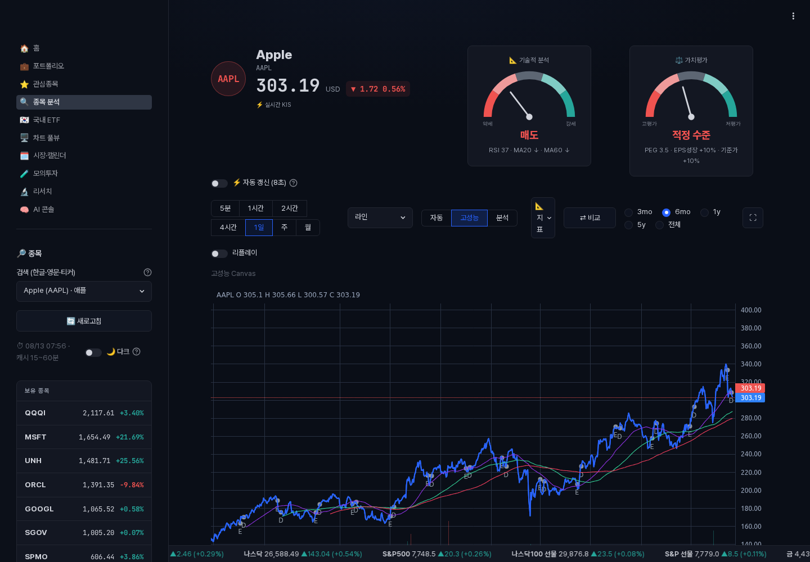
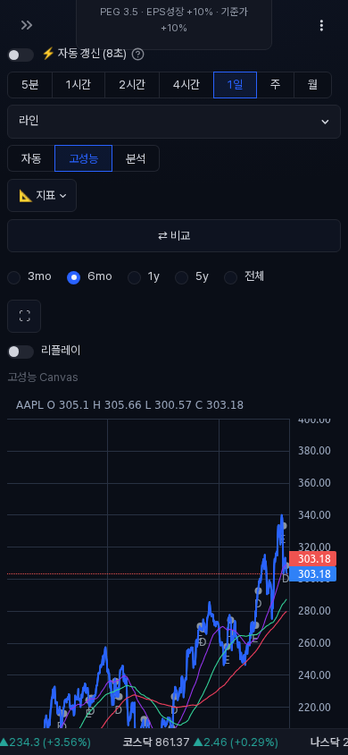

# Canvas chart verification

검증일: 2026-08-13 UTC

## 범위

- 종목 분석과 멀티차트의 `auto / canvas / plotly` 렌더러 선택
- 5,000봉 이상 대용량 차트의 Canvas 자동 선택
- 하단 패널, 고급 오버레이, 편집 주문선 사용 시 Plotly 폴백
- 데스크톱과 모바일 화면의 비어 있지 않은 Canvas, 가로 넘침, 런타임 오류
- KIS 스트림 시작 직후 오더플로 캡처 상태 공개

## 성능

| 항목 | 표본 | p95 | 최대 | 기준 |
|---|---:|---:|---:|---:|
| Python 5,000봉 payload 생성 | 40회 | 9.821ms | 43.997ms | p95 < 50ms |
| Chromium Lightweight Charts `setData` | 10회 | 13.200ms | 13.200ms | p95 < 50ms |

봉 데이터는 행별 객체 5,000개 대신 OHLC 열 배열로 전달한다. 이 방식은 Python 객체 할당과 세대별 GC 정지를 줄이고, 브라우저에서 Lightweight Charts 입력 객체로 한 번 변환한다.

## 브라우저 검증

| 화면 | 뷰포트 | 결과 |
|---|---|---|
| 종목 차트 | 1440x1000 | Canvas 비공백, 가로 넘침 없음, console/page/request 오류 0 |
| 종목 차트 | 390x844 | Canvas 비공백, 가로 넘침 없음, console/page/request 오류 0 |
| RSI 활성화 | 1440x1000 | `분석 Plotly · 하단 분석 패널` 폴백 표시 및 Plotly 렌더링 |

## 자동화 검증

- 차트, 대시보드, KIS, 오더플로, 포트폴리오 감사: `530 passed, 1 skipped`
- Canvas 단위 및 런타임: `15 passed, 1 skipped`
- 실제 Chromium 성능 게이트: `2 passed`
- 전체 스위트 분할 실행: `2,389 passed, 1 skipped`
- 운영 smoke: `SMOKE_FAILURES 0`

## 트레이드오프

- Canvas 런타임은 고정 버전 CDN에 의존하므로 로드 실패 시 사용자가 Plotly로 전환할 수 있다.
- 하단 분석 패널, 편집 주문선, Canvas 미지원 차트 유형은 기능 보존을 위해 Plotly를 유지한다.
- 열 지향 payload는 전송과 생성이 빠르지만 브라우저에서 한 번의 행 객체 변환 비용이 발생한다.
